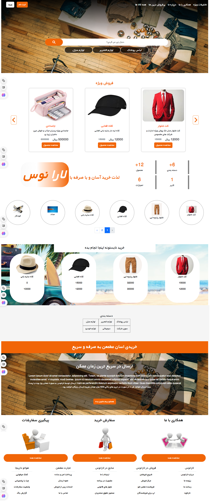
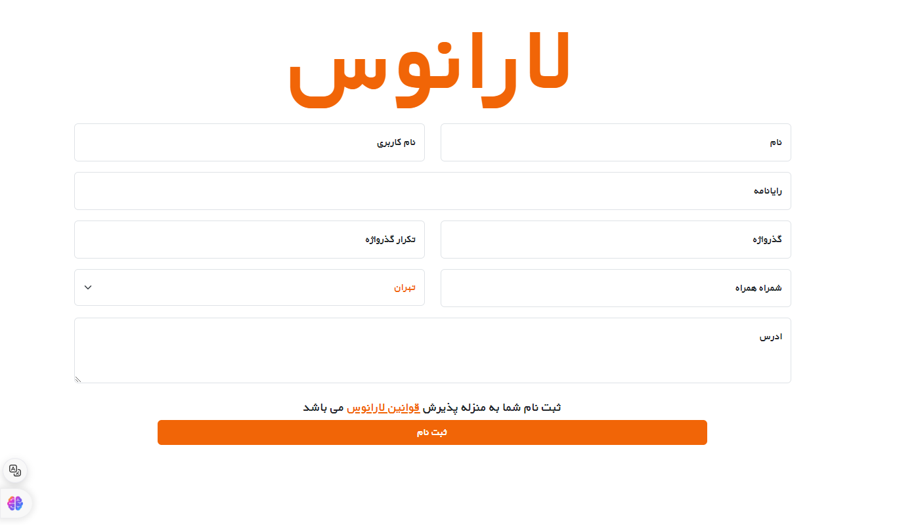
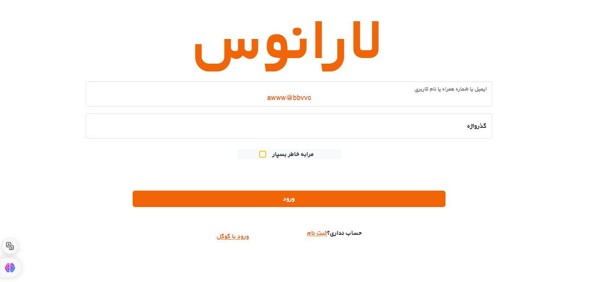

<h2>Laranos-online-shop  🏚 </h2>

A good store will have various features and characteristics that enhance the shopping experience. Here is my attempt to answer this question in this repository:

From the moment you enter, everything is designed to be modern and up-to-date until the moment of payment.

<h3>Features 🔥</h3>

* MVC ✔
* 2 type user: User , Admin ✔
* Remember Me Token ✔
* Protecting with RecaptchaV3 ✔
* Check Response`s ✔
* categorize products ✔
* Dainamic Home Page ✔ 
* Add|Remove|Edit Products by Admin ✔
* Add|Remove|Edit Categorize by Admin ✔
* manage User , Orders , buy`s by Admin ✔
* Rating && Comments (Using File For Users Comment) ✔
* Well-designed User Interface & User Experience  ✔

<h3> ✨ Tech</h3>

  

<h3>Goals  🎯</h3>

 Sell and Buy 

<h3>See Some image(s) 📸</h3>
* Home

* register

* Login

<h3>Developer(s) ⚡ </h3>
<a href="https://www.GitHub.com/moeinfadakar">Moein Fadakar</a>

<h3>Licence</h3>

The Laravel framework is open-sourced software licensed under the [MIT license](https://opensource.org/licenses/MIT).
